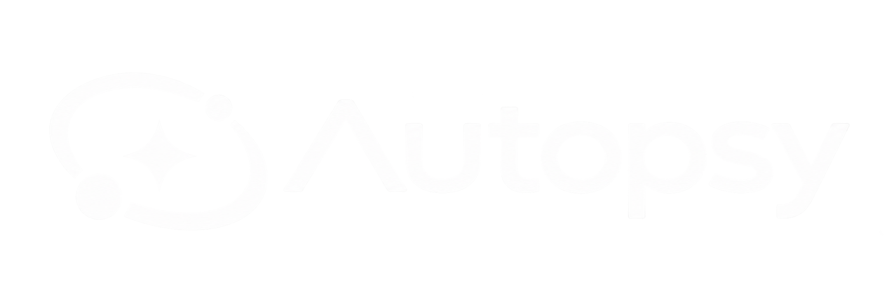

<div align="center">
  
  <h1>🕵️‍♂️ Crypto Autopsy</h1>
  <p><strong>The Crypto Death Investigation Agent</strong></p>
  <p><em>Built for the CoinMarketCap API Hackathon 2026</em></p>
</div>

---

## 📌 Concept & Background
While the entire cryptocurrency market is endlessly searching for the next "100x Moonshot," **Crypto Autopsy** takes the exact opposite approach. We act as forensic pathologists for dying, dead, and bleeding cryptocurrencies. 

Many investors lose capital by failing to recognize the structural breakdown of a token's momentum and liquidity. Crypto Autopsy solves this by using live telemetry to calculate a definitive **Death Risk Score (0-100)** and generating a comprehensive visual forensic report. It acts as an early warning system and a post-mortem analysis tool, complete with an AI "Doctor Agent" that allows users to interrogate the data in real-time.

## ✨ Key Features
- **Algorithmic Death Score Engine**: Mathematically calculates the risk of token collapse based on 24h/7d/30d/90d price vectors, volume-to-mcap ratios, and FDV inflation overhangs.
- **Premium Institutional DeFi UI**: A highly polished, Spark Finance-inspired frontend featuring ambient glassmorphism glows, clean typography, and beautifully animated data visualization cards.
- **Smart Search & Resolution**: Search for a token by its Ticker (e.g., `BTC`) or its Project Name (e.g., `Bitcoin`). Our backend intelligently falls back to CoinMarketCap `slugs` to resolve tokens seamlessly.
- **Dynamic AI Doctor Terminal**: An integrated LLM chat agent (powered by OpenAI) that ingests live CMC telemetry as prompt context and answers specific questions about why a token is failing.
- **Built-in Rate Limit Resilience**: Features a dynamic heuristic fallback engine if the LLM core is unreachable (e.g., 429 Quota Exceeded), ensuring the terminal always operates during critical investigations.

## 🛠 CoinMarketCap API Integration Strategy
Crypto Autopsy relies heavily on the precision of CMC's live data pipelines to fuel its algorithms.

### 1. Token Identity & Metadata
**Endpoint:** `GET /v1/cryptocurrency/info`
- **Usage:** Extracts token identity, category tags, official website/social links, and logo.
- **Innovation:** Implemented a dual-resolution system. If searching by `symbol` fails, the backend automatically transforms the query into a `slug` (e.g., "SafeMoon" -> "safemoon") to guarantee successful metadata retrieval.

### 2. Live Telemetry & Scoring
**Endpoint:** `GET /v2/cryptocurrency/quotes/latest`
- **Usage:** The core engine of our forensics. Extracts real-time price, 1h/24h/7d/30d/60d/90d percent changes, 24h volume, market cap, and fully diluted valuation (FDV).
- **Innovation:** By mathematically synthesizing the 30d/60d/90d data from the standard `/latest` endpoint, we successfully emulate deep macro-trend analysis without requiring enterprise-level `/historical` endpoints. It automatically detects extreme liquidity exhaustion (Volume < 5% of Mcap) and flags it as a "Critical Finding".

## 🏗️ System Architecture
- **Backend**: Python 3.10+, FastAPI, Uvicorn, Requests
- **Frontend**: Next.js 14+ (App Router), React, Tailwind CSS v4
- **AI Engine**: OpenAI API (`gpt-4o-mini`) + Fallback Heuristics
- **Data Source**: CoinMarketCap Pro API

## 🚀 Local Installation & Setup

### Prerequisites
- Python 3.10+
- Node.js 18+
- A valid [CoinMarketCap API Key](https://pro.coinmarketcap.com/)
- A valid [OpenAI API Key](https://platform.openai.com/)

### 1. Backend Setup (FastAPI)
```bash
# Navigate to the backend directory
cd backend

# Create and activate a virtual environment
python -m venv venv
# Windows:
.\venv\Scripts\activate
# Mac/Linux:
source venv/bin/activate

# Install dependencies
pip install -r requirements.txt

# Create environment variables file
echo "CMC_API_KEY=your_cmc_key_here" > .env
echo "OPENAI_API_KEY=your_openai_key_here" >> .env

# Run the backend server
uvicorn main:app --reload --port 8000
```

### 2. Frontend Setup (Next.js & Tailwind v4)
```bash
# Open a new terminal and navigate to the frontend directory
cd frontend

# Install Node modules
npm install

# Start the development server
npm run dev
```
Navigate to `http://localhost:3000` in your web browser to access the Forensic Terminal.

## 📈 Testing the Platform
To see the true power of the Death Score Engine, try searching for historically collapsed or highly volatile tokens rather than stable assets like BTC.
- **Try searching:** `LUNA`, `FTT`, `SAFEMOON`, `VGX`

---
*Disclaimer: Crypto Autopsy is an educational and analytical tool built for a hackathon. It does not constitute financial or investment advice. Always DYOR.*
